# Lab Two
### Authors: Eric Smith, Tyler Giallanza, Oscar Vallner, Momin Irfan

#### Special thanks to [Justin Ledford](https://github.com/justinledford) for a lot of the code.

In this lab, we implemented photo style transfer from the [Universal Style Transfer](https://arxiv.org/abs/1705.08086) paper and applied photorealistic stylization [also from by Li *et al*](https://arxiv.org/abs/1705.08086).

_________

## Unpooling

We implemented unpooling by creating our own custom layers: MaxPoolingMax2D and Unpooling. The MaxPoolingMask2D is used with our encoder to save the locations of the maximums when the image is pooled whilst encoded. The unpooling takes the encoded image and the masks which it then unpools.

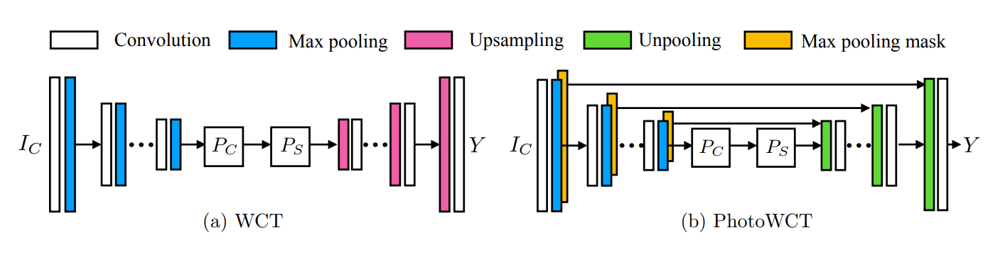

The above image shows the strategy we employed to implement unpooling.The unpooling custom layers are included below and can be accessed 


```python
from keras import backend as K
from keras.layers.convolutional import UpSampling2D
from keras.layers import MaxPooling2D, Layer
import tensorflow as tf

class MaxPoolingMask2D(MaxPooling2D):
    def __init__(self, pool_size=(2, 2), strides=None, **kwargs):
        super(MaxPoolingMask2D, self).__init__(pool_size, strides, **kwargs)

    def _pooling_function(self, inputs, pool_size, strides, padding, data_format):
        pooled = K.pool2d(inputs, pool_size, strides, pool_mode='max')
        upsampled = UpSampling2D(size=pool_size)(pooled)
        indexMask = K.tf.equal(inputs, upsampled)
        assert indexMask.get_shape().as_list() == inputs.get_shape().as_list()
        return indexMask

    def get_output_shape_for(self, input_shape):
        return input_shape

class Unpooling(Layer):
    def __init__(self, **kwargs):
        super(Unpooling, self).__init__(**kwargs)

    def build(self, input_shape):
        pass

    def call(self, x, mask=None):
        layer = x[0]
        layer_mask = x[1]
        print('unpooling input - layer shape:',layer.shape,'mask shape:',layer_mask.shape)
        mask_shape = layer_mask.get_shape().as_list()
        layer_shape = layer.get_shape().as_list()
        pool_size = (2,2) 

        on_success = tf.keras.backend.resize_images(layer, 2, 2, 'channels_last')

        on_fail = K.zeros_like(on_success)
        output =  K.tf.where(K.tf.cast(layer_mask,bool), on_success, on_fail)
        print('    ',output.shape)
        return output


    def compute_output_shape(self, input_shape):
        return input_shape[1]


```

_________

### Decoder Training
For our decoders, we started with the vgg19 weights from François Chollet. A link to these weights are in the code below.

After loading the weights, we did additional training on the VGG19 decoders. To train our decoders, we used a 192MB data set of Urban and Natural Scene photos from the Computational Visual Cognition Laboratory at MIT. The dataset can be found here: http://cvcl.mit.edu/database.htm 
We liked this dataset as all the images were 256x256, and the dataset was large enough for our use.

We trained a total of 5 image decoders, one for each of the 5 blocks in our VGG19 network. The code for this can be seen below.


```python
from keras.models import Model
from keras.layers import Conv2D, MaxPooling2D, GlobalMaxPooling2D, Input
from keras.utils.data_utils import get_file
import keras.backend as K
import h5py
import numpy as np
import tensorflow as tf
from unpooling import *

WEIGHTS_PATH_NO_TOP = 'https://github.com/fchollet/deep-learning-models/releases/download/v0.1/vgg19_weights_tf_dim_ordering_tf_kernels_notop.h5'

MEAN_PIXEL = np.array([103.939, 116.779, 123.68])

WEIGHTS_PATH = get_file('vgg19_weights_tf_dim_ordering_tf_kernels_notop.h5',
                        WEIGHTS_PATH_NO_TOP,
                        cache_subdir='models',
                        file_hash='253f8cb515780f3b799900260a226db6')

def vgg_layers(inputs, target_layer):
    masks = [] 
    # Block 1
    #(256,256,3)
    x = Conv2D(64, (3, 3), activation='relu', padding='same', name='block1_conv1')(inputs) #(256,256,64)
    if target_layer == 1:
        return [x,*masks]
    x = Conv2D(64, (3, 3), activation='relu', padding='same', name='block1_conv2')(x) #(256,256,64) 
    mask_1 = MaxPoolingMask2D(pool_size=(2,2),strides=(2, 2),name='block1_pool_index')(x) #(256,256,64)
    x = MaxPooling2D((2, 2), strides=(2, 2), name='block1_pool')(x) #(128,128,64)
    masks.append(mask_1)

    # Block 2
    x = Conv2D(128, (3, 3), activation='relu', padding='same', name='block2_conv1')(x) #(128,128,128)
    if target_layer == 2:
        return [x,*masks]
    x = Conv2D(128, (3, 3), activation='relu', padding='same', name='block2_conv2')(x)
    mask_2 = MaxPoolingMask2D(pool_size=(2,2), strides=(2, 2), name='block2_pool_index')(x) #(64,64,128)
    x = MaxPooling2D((2, 2), strides=(2, 2), name='block2_pool')(x)
    masks.append(mask_2)

    # Block 3
    x = Conv2D(256, (3, 3), activation='relu', padding='same', name='block3_conv1')(x) #(64,64,256)
    if target_layer == 3:
        return [x,*masks]
    x = Conv2D(256, (3, 3), activation='relu', padding='same', name='block3_conv2')(x)
    x = Conv2D(256, (3, 3), activation='relu', padding='same', name='block3_conv3')(x)
    x = Conv2D(256, (3, 3), activation='relu', padding='same', name='block3_conv4')(x)
    mask_3 = MaxPoolingMask2D(pool_size=(2,2), strides=(2, 2), name='block3_pool_index')(x)
    x = MaxPooling2D((2, 2), strides=(2, 2), name='block3_pool')(x) #(32,32,256)
    masks.append(mask_3)

    # Block 4
    x = Conv2D(512, (3, 3), activation='relu', padding='same', name='block4_conv1')(x) #(32,32,512)
    if target_layer == 4:
        return [x,*masks]
    x = Conv2D(512, (3, 3), activation='relu', padding='same', name='block4_conv2')(x)
    x = Conv2D(512, (3, 3), activation='relu', padding='same', name='block4_conv3')(x)
    x = Conv2D(512, (3, 3), activation='relu', padding='same', name='block4_conv4')(x)
    mask_4 = MaxPoolingMask2D(pool_size=(2,2), strides=(2, 2), name='block4_pool_index')(x)
    x = MaxPooling2D((2, 2), strides=(2, 2), name='block4_pool')(x) #(16,16,512)
    masks.append(mask_4)

    # Block 5
    x = Conv2D(512, (3, 3), activation='relu', padding='same', name='block5_conv1')(x) #(16,16,512)
    return [x,*masks]

```

_________

## Image Reconstruction
We constructed a few images based using the new trained decoders.

| Layer | Output |
|---|---|
| Original: |  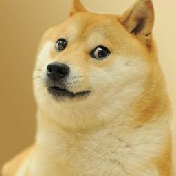|
| Layer 2: | 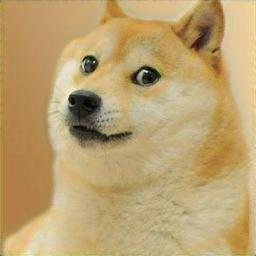|
| Layer 3: | 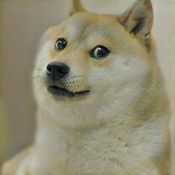|
| Layer 4: | 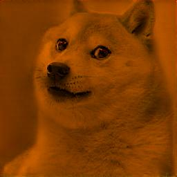|
| Layer 5: | 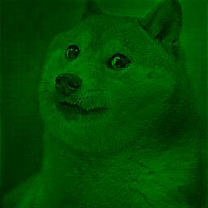|

----

As the decoder layer gets deeper in the network, more and more artifacts appear in the images. In Layer 2, there are few discernible differences from the original, other than perhaps a slight shift in the hue. With Layer 3 however, the hue shift is quite a bit more noticable, as if someone had turned down the saturation of the image. Layer 4 brings the first dramatic shift, with the entire image having a dark orange tint. The final layer has another dramatic shift, although this one is towards green. Additionally, more noise is present in the final layer, as the whole photo appears blotchy and more like a painting.

___

## Smoothing
The results generated using the universal style transform algorithm typically appear to match the style and content of the specified images. However, these images often contain artifacts that appear unnatural or non-realistic, even when applying the WCT transform. To address this issue, Li et al. 2018 proposed a smoothing constraint to generate photo-realistic style transfer images.

This smoothing constraint gets applied to an image that is already stylized; by using information present in the original content image, the smoothing process results in a more realistic looking image. Furthermore, the constraint is derived as a closed-form solution, so it does not require further optimization to derive and is thus fairly efficient to compute.

The smoothing constraint seeks to encourage consistent stylization within regions by considering the local statistics of each pixel (mean and variance of the 8 neighboring pixels). This smoothing process often results in the removal of artifacts from images stylized with the WCT transform. However, the results can be further improved according to Li et al. 2018 by slightly modifying the WCT algorithm. We consider this modification beyond the scope of the paper; rather, we use the traditional WCT process but add the smoothing constraint and compare those results to results obtained without the use of a smoothing constraint.


```python
"""
Copyright (C) 2018 NVIDIA Corporation.    All rights reserved.
Licensed under the CC BY-NC-SA 4.0 license (https://creativecommons.org/licenses/by-nc-sa/4.0/legalcode).
"""
from __future__ import division
import scipy.misc
import numpy as np
import scipy.sparse
import scipy.sparse.linalg
from numpy.lib.stride_tricks import as_strided
from PIL import Image
import matplotlib.pyplot as plt


#Class that defines operations for smoothing a stylized image.
class Smoother(object):
    def __init__(self, beta=0.9999):
        self.beta = beta

    #smooths stylized image using information from the content image.
    def smooth(self, initImg, contentImg):
        if type(contentImg) == str:
            content = scipy.misc.imread(contentImg, mode='RGB')
        else:
            content = contentImg.copy()

        if type(initImg) == str:
            B = scipy.misc.imread(initImg, mode='RGB').astype(np.float64) / 255
        else:
            B = scipy.asarray(initImg).astype(np.float64) / 255
        h1,w1,k = B.shape
        #remove edge artifacts by pretending the image is 2 pixels smaller than it is per side
        h = h1 - 4
        w = w1 - 4
        B = B[int((h1-h)/2):int((h1-h)/2+h),int((w1-w)/2):int((w1-w)/2+w),:]
        content = scipy.misc.imresize(content,(h,w))
        #replace the removed edges with padding
        B = self.__replication_padding(B,2)
        content = self.__replication_padding(content,2)
        content = content.astype(np.float64)/255
        
        #Flatten the image
        B = np.reshape(B,(h1*w1,k))
        #Compute laplacian of the content image
        W = self.__compute_laplacian(content)
        W = W.tocsc() #make the laplacian sparse
        dd = W.sum(0) #Sum along the first axis of W
        dd = np.sqrt(np.power(dd,-1)) #Take dd to the -1/2 power
        dd = dd.A.squeeze() #remove the extra dimension at the end of dd
        D = scipy.sparse.csc_matrix((dd, (np.arange(0,w1*h1), np.arange(0,w1*h1)))) #blow up dd to become the diagonal of D
        S = D.dot(W).dot(D) #S = D dot W dot D
        A = scipy.sparse.identity(w1*h1) - self.beta*S #A = I - beta*S
        A = A.tocsc() #Make A sparse
        solver = scipy.sparse.linalg.factorized(A) # solves decomposition of A - will have 3 outputs
        V = np.zeros((h1*w1,k)) #V is the flattened shape of the output image
        V[:,0] = solver(B[:,0]) #Add each color channel back to V
        V[:,1] = solver(B[:,1])
        V[:,2] = solver(B[:,2])
        V = V*(1-self.beta)
        V = V.reshape(h1,w1,k) #Reshape V into the output image size
        V = V[2:2+h,2:2+w,:] #Remove the reflective padding so the image is the proper size
        
        img = Image.fromarray(np.uint8(np.clip(V * 255., 0, 255.))) #Clip images into RGB range
        return img

    # Returns sparse matting laplacian
    # The implementation of the function is heavily borrowed from
    # https://github.com/MarcoForte/closed-form-matting/blob/master/closed_form_matting.py
    # We thank Marco Forte for sharing his code.
    def __compute_laplacian(self, img, eps=10**(-7), win_rad=1):
            win_size = (win_rad*2+1)**2 #compute the size of the window used - defaults to 3x3 window
            h, w, d = img.shape #extract shape from the image
            c_h, c_w = h - 2*win_rad, w - 2*win_rad #remove edges that would form fractional windows
            win_diam = win_rad*2+1
            indsM = np.arange(h*w).reshape((h, w)) #Indices in the range 0:h*w in the shape h by w
            ravelImg = img.reshape(h*w, d) #flatten the image pixels into color channels
            win_inds = self.__rolling_block(indsM, block=(win_diam, win_diam)) #change the indices into window indices
            win_inds = win_inds.reshape(c_h, c_w, win_size)
            winI = ravelImg[win_inds] #break the image up into windows
            win_mu = np.mean(winI, axis=2, keepdims=True) #Take the mean of each window
            win_var = np.einsum('...ji,...jk ->...ik', winI, winI)/win_size - np.einsum('...ji,...jk ->...ik', win_mu, win_mu) #Take the variance of each window
            inv = np.linalg.inv(win_var + (eps/win_size)*np.eye(3)) #Fancy numpy to normalize the diagonal by the window size and add the inverse of the window variance elsewhere
            X = np.einsum('...ij,...jk->...ik', winI - win_mu, inv) 
            vals = (1/win_size)*(1 + np.einsum('...ij,...kj->...ik', X, winI - win_mu)) #the values of the laplacian that will be added to the final array
            nz_indsCol = np.tile(win_inds, win_size).ravel() #col locations to add values at
            nz_indsRow = np.repeat(win_inds, win_size).ravel() #row locations to add values at
            nz_indsVal = vals.ravel() #values to add to the final array
            L = scipy.sparse.coo_matrix((nz_indsVal, (nz_indsRow, nz_indsCol)), shape=(h*w, h*w)) #add the values into the n by n array at the proper indices
            return L

    #Adds padding of the specified amount to the edge of a given image by replication.
    def __replication_padding(self, arr,pad):
            h,w,c = arr.shape
            ans = np.zeros((h+pad*2,w+pad*2,c))
            for i in range(c):
                    ans[:,:,i] = np.pad(arr[:,:,i],pad_width=(pad,pad),mode='edge')
            return ans

    #Strides an input array in 2 dimensions into blocks of a given size.
    def __rolling_block(self, A, block=(3, 3)):
        shape = (A.shape[0] - block[0] + 1, A.shape[1] - block[1] + 1) + block
        strides = (A.strides[0], A.strides[1]) + A.strides
        return as_strided(A, shape=shape, strides=strides)
```

    /usr/local/lib/python2.7/site-packages/scipy/linalg/basic.py:17: RuntimeWarning: numpy.dtype size changed, may indicate binary incompatibility. Expected 96, got 88
      from ._solve_toeplitz import levinson
    /usr/local/lib/python2.7/site-packages/scipy/linalg/__init__.py:207: RuntimeWarning: numpy.dtype size changed, may indicate binary incompatibility. Expected 96, got 88
      from ._decomp_update import *
    /usr/local/lib/python2.7/site-packages/scipy/special/__init__.py:640: RuntimeWarning: numpy.dtype size changed, may indicate binary incompatibility. Expected 96, got 88
      from ._ufuncs import *
    /usr/local/lib/python2.7/site-packages/scipy/special/_ellip_harm.py:7: RuntimeWarning: numpy.dtype size changed, may indicate binary incompatibility. Expected 96, got 88
      from ._ellip_harm_2 import _ellipsoid, _ellipsoid_norm
    /usr/local/lib/python2.7/site-packages/scipy/interpolate/_bsplines.py:10: RuntimeWarning: numpy.dtype size changed, may indicate binary incompatibility. Expected 96, got 88
      from . import _bspl
    /usr/local/lib/python2.7/site-packages/scipy/sparse/lil.py:19: RuntimeWarning: numpy.dtype size changed, may indicate binary incompatibility. Expected 96, got 88
      from . import _csparsetools
    /usr/local/lib/python2.7/site-packages/scipy/sparse/csgraph/__init__.py:165: RuntimeWarning: numpy.dtype size changed, may indicate binary incompatibility. Expected 96, got 88
      from ._shortest_path import shortest_path, floyd_warshall, dijkstra,\
    /usr/local/lib/python2.7/site-packages/scipy/sparse/csgraph/_validation.py:5: RuntimeWarning: numpy.dtype size changed, may indicate binary incompatibility. Expected 96, got 88
      from ._tools import csgraph_to_dense, csgraph_from_dense,\
    /usr/local/lib/python2.7/site-packages/scipy/sparse/csgraph/__init__.py:167: RuntimeWarning: numpy.dtype size changed, may indicate binary incompatibility. Expected 96, got 88
      from ._traversal import breadth_first_order, depth_first_order, \
    /usr/local/lib/python2.7/site-packages/scipy/sparse/csgraph/__init__.py:169: RuntimeWarning: numpy.dtype size changed, may indicate binary incompatibility. Expected 96, got 88
      from ._min_spanning_tree import minimum_spanning_tree
    /usr/local/lib/python2.7/site-packages/scipy/sparse/csgraph/__init__.py:170: RuntimeWarning: numpy.dtype size changed, may indicate binary incompatibility. Expected 96, got 88
      from ._reordering import reverse_cuthill_mckee, maximum_bipartite_matching, \
    /usr/local/lib/python2.7/site-packages/scipy/spatial/__init__.py:95: RuntimeWarning: numpy.dtype size changed, may indicate binary incompatibility. Expected 96, got 88
      from .ckdtree import *
    /usr/local/lib/python2.7/site-packages/scipy/spatial/__init__.py:96: RuntimeWarning: numpy.dtype size changed, may indicate binary incompatibility. Expected 96, got 88
      from .qhull import *
    /usr/local/lib/python2.7/site-packages/scipy/spatial/_spherical_voronoi.py:18: RuntimeWarning: numpy.dtype size changed, may indicate binary incompatibility. Expected 96, got 88
      from . import _voronoi
    /usr/local/lib/python2.7/site-packages/scipy/spatial/distance.py:122: RuntimeWarning: numpy.dtype size changed, may indicate binary incompatibility. Expected 96, got 88
      from . import _hausdorff


```python
import scipy.misc 

def smooth_image(styled_image,content_image):
    print("Smoothing image...")
    s = Smoother()
    smoothed_image = s.smooth(styled_image,content_image)
    print('Content image:')
    plt.imshow(content_image)
    plt.show()
    print('Styled image:')
    plt.imshow(styled_image)
    plt.show()
    print('Smoothed image:')
    plt.imshow(smoothed_image)
    plt.show()


styled_image = scipy.misc.imread('./output_images/wavestyled_doge.jpg', mode='RGB')
content_image = scipy.misc.imread('./input_images/doge-256.jpg', mode='RGB')

smooth_image(styled_image,content_image)
```

    /usr/local/lib/python2.7/site-packages/ipykernel_launcher.py:19: DeprecationWarning: `imread` is deprecated!
    `imread` is deprecated in SciPy 1.0.0, and will be removed in 1.2.0.
    Use ``imageio.imread`` instead.
    /usr/local/lib/python2.7/site-packages/ipykernel_launcher.py:20: DeprecationWarning: `imread` is deprecated!
    `imread` is deprecated in SciPy 1.0.0, and will be removed in 1.2.0.
    Use ``imageio.imread`` instead.
    /usr/local/lib/python2.7/site-packages/ipykernel_launcher.py:36: DeprecationWarning: `imresize` is deprecated!
    `imresize` is deprecated in SciPy 1.0.0, and will be removed in 1.2.0.
    Use ``skimage.transform.resize`` instead.


    Smoothing image...
    Content image:


    Styled image:


    Smoothed image:


----
## Styling Examples

|Content|Style|Output|Smoothed|
|---|---|---|---|
||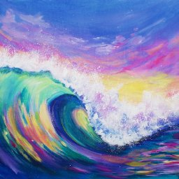|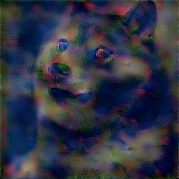|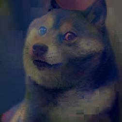|
|||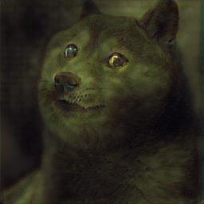|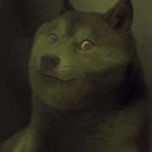|
||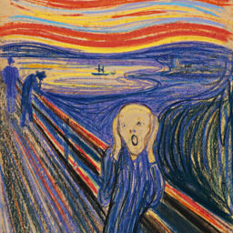|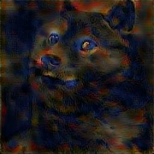|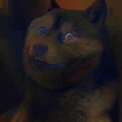|
||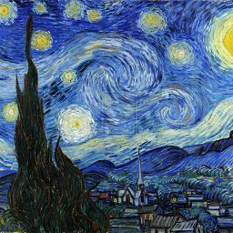|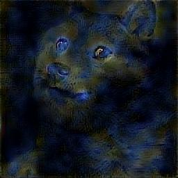|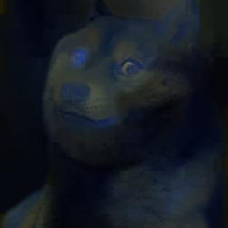|

The output images above were generated using all 5 layer decoders, shown in the code below.

A lot of noise is present in the output photos. In most instances, most notably the Mona Lisa style transfer, the smoothing helps reduce the noise and keeps the style from the original image intact. However, for the Starry Night style transfer, much of the style from the original image is lost in the smoothing process. This is because the distinctive style present in the original Starry Night painting is, in our opinion, largely impacted by the brush strokes and painting technique used. More of these brush-stroke-type artifacts are present in the non-smoothed output, making it closer in style to the original Starry Night image. This is in line with what one would expect, as smoothing is geared towards providing more of a photo-realisitic style transfer and as such does better with style images that more closely resemble real life, such as in the case with Mona Lisa.

#### Style Transfer Code


```python
import sys

from keras.models import load_model
from keras.preprocessing import image
from keras import backend as K
import numpy as np
from scipy.misc import imsave
from unpooling import *

from vgg import VGG19, preprocess_input

def get_vgg_features(inputs, target_layer):
    encoder = VGG19(input_shape=(256,256,3), target_layer=target_layer)
    return encoder.predict(inputs)


def wct(content, style, alpha=0.6, eps=1e-5):
    '''
    https://github.com/eridgd/WCT-TF/blob/master/ops.py

       Perform Whiten-Color Transform on feature maps using numpy
       See p.4 of the Universal Style Transfer paper for equations:
       https://arxiv.org/pdf/1705.08086.pdf
    '''
    # 1xHxWxC -> CxHxW
    content_t = np.transpose(np.squeeze(content), (2, 0, 1))
    style_t = np.transpose(np.squeeze(style), (2, 0, 1))

    # CxHxW -> CxH*W
    content_flat = content_t.reshape(-1, content_t.shape[1]*content_t.shape[2])
    style_flat = style_t.reshape(-1, style_t.shape[1]*style_t.shape[2])

    # Whitening transform
    mc = content_flat.mean(axis=1, keepdims=True)
    fc = content_flat - mc
    fcfc = np.dot(fc, fc.T) / (content_t.shape[1]*content_t.shape[2] - 1)
    Ec, wc, _ = np.linalg.svd(fcfc)
    k_c = (wc > 1e-5).sum()
    Dc = np.diag((wc[:k_c]+eps)**-0.5)
    fc_hat = Ec[:,:k_c].dot(Dc).dot(Ec[:,:k_c].T).dot(fc)

    # Coloring transform
    ms = style_flat.mean(axis=1, keepdims=True)
    fs = style_flat - ms
    fsfs = np.dot(fs, fs.T) / (style_t.shape[1]*style_t.shape[2] - 1)
    Es, ws, _ = np.linalg.svd(fsfs)
    k_s = (ws > 1e-5).sum()
    Ds = np.sqrt(np.diag(ws[:k_s]+eps))
    fcs_hat = Es[:,:k_s].dot(Ds).dot(Es[:,:k_s].T).dot(fc_hat)
    fcs_hat = fcs_hat + ms

    # Blend transform features with original features
    blended = alpha*fcs_hat + (1 - alpha)*(fc)

    # CxH*W -> CxHxW
    blended = blended.reshape(content_t.shape)
    # CxHxW -> 1xHxWxC
    blended = np.expand_dims(np.transpose(blended, (1,2,0)), 0)

    return np.float32(blended)


img_c = image.load_img(sys.argv[1])
img_c = image.img_to_array(img_c)
img_c_shape = img_c.shape
img_c = np.expand_dims(img_c, axis=0)

img_s = image.load_img(sys.argv[2])
img_s = image.img_to_array(img_s)
img_s_shape = img_s.shape
img_s = np.expand_dims(img_s, axis=0)

assert img_c_shape == img_s_shape, \
    'Content and style image should be the same shape, %s != %s' \
    % (str(img_c_shape), str(img_s_shape))

input_shape = img_c_shape

print('Loading decoders...')
decoders = {}
decoders[1] = load_model('./models/decoder_1.h5')
decoders[2] = load_model('./models/decoder_2.h5', custom_objects={'Unpooling':Unpooling})
decoders[3] = load_model('./models/decoder_3.h5', custom_objects={'Unpooling':Unpooling})
decoders[4] = load_model('./models/decoder_4.h5', custom_objects={'Unpooling':Unpooling})
decoders[5] = load_model('./models/decoder_5.h5', custom_objects={'Unpooling':Unpooling})


import matplotlib.pyplot as plt

plt.imshow(np.clip(img_c[0] / 255, 0, 1))
plt.show()

print('Styling...')
for i in [5,4,3,2,1]:
    print('Loading VGG...')
    feats_c = get_vgg_features(img_c, i)
    feats_s = get_vgg_features(img_s, i)
    feats_cs = wct(feats_c[0], feats_s[0])

    if i == 1: 
        wct_output = [feats_cs]
    else:
        wct_output = [feats_cs]
        for x in feats_c[1:]:
            wct_output.append(x)

    print(f"shape: {feats_cs.shape}")
    img_c = decoders[i].predict(wct_output)
    plt.imshow(np.clip(img_c[0] / 255, 0, 1))
    plt.show()

print('Saving output...')
output_img = img_c[0]

imsave(sys.argv[3], output_img)

```
