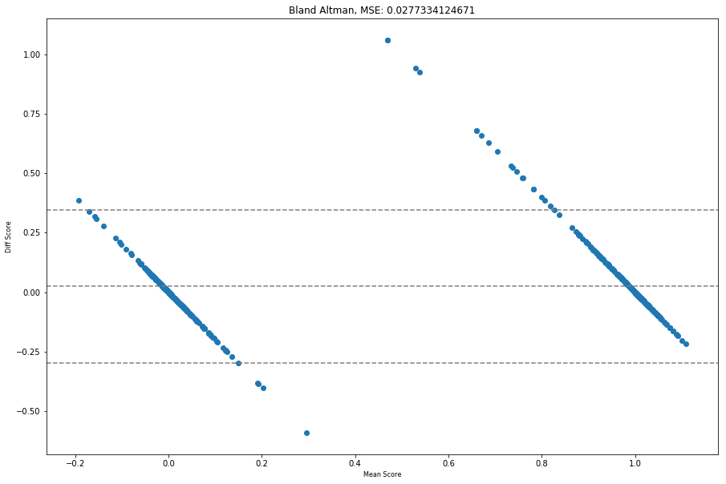

# Lab 3: Multi-Task Models 
Momin Irfan, Tyler Giallanza, Eric Smith, Oscar Vallner

## Setup for this lab

1. Download the data from the following link: https://smu.box.com/s/smqmwlef0yehpieicwxqdr99k7f9ru04
2. Extract the downloaded data into Lab3/data
3. Run the `query.py` script in the data folder
4. Install RDKit for Python: https://www.rdkit.org/docs/Install.html

NOTE: I found it significantly easier to download RDKit using the apt package for Ubuntu. However, this installed the Python2 version of RDKit instead of the Python3 version. If you are using Python3, the only difference is reading in the data using pickle.


```python
import numpy as np
import pandas as pd
from rdkit import Chem, DataStructs
from rdkit.Chem import MACCSkeys, AllChem
from rdkit.Chem import ChemicalFeatures
from rdkit.Chem.Fingerprints import FingerprintMols
from rdkit import RDConfig
import os
import pickle
from random import shuffle

import keras
from keras.layers import Input, Dense
from keras.models import Model

```

    Using TensorFlow backend.


```python
X = pickle.load(open('data/data.pkl','rb'))
```


```python
df = pd.DataFrame.from_dict(X)#.head(200)
del X
```


```python
# remove values in the middle
df = df[(df.ic50.astype(float) > 10000) | (df.ic50.astype(float) < 300)]

# binarize ic50
df.ic50 = df.ic50.astype(float) < 10000
```


```python
def get_morgan_fingerprints(smiles):
    fdefName = os.path.join(RDConfig.RDDataDir,'BaseFeatures.fdef')
    factory = ChemicalFeatures.BuildFeatureFactory(fdefName)
    fps = []
    for smile in smiles:
        m = Chem.MolFromSmiles(smile)
        if m is not None:
            fps.append(AllChem.GetMorganFingerprintAsBitVect(m, 2, nBits=512))
        else:
            fps.append(None)
    return fps

def get_topological_fingerprints(smiles):
    fdefName = os.path.join(RDConfig.RDDataDir,'BaseFeatures.fdef')
    factory = ChemicalFeatures.BuildFeatureFactory(fdefName)
    fps = []
    for smile in smiles:
        m = Chem.MolFromSmiles(smile)
        if m is not None:
            fps.append(FingerprintMols.FingerprintMol(m))
        else:
            fps.append(None)
    return fps
```


```python
# build feature factory
fdefName = os.path.join(RDConfig.RDDataDir,'BaseFeatures.fdef')
factory = ChemicalFeatures.BuildFeatureFactory(fdefName)

#fps = []
#all_smiles = df.smiles
df['morgan_fps'] = get_morgan_fingerprints(df.smiles)
df['topological_fps'] = get_topological_fingerprints(df.smiles)
df = df[df.morgan_fps != None]
df = df.drop(columns=['smiles'])
```


```python
uq_targets = set(df.target)
target_data = {}
for target in uq_targets:
    target_data[target] = [[],[],[]]

for index, row in df.iterrows():
    try:
        morgan = np.zeros((1,))
        topo = np.zeros((1,))
        DataStructs.ConvertToNumpyArray(row.morgan_fps, morgan)
        DataStructs.ConvertToNumpyArray(row.topological_fps, topo)
        target_data[row.target][0].append(morgan)
        target_data[row.target][1].append(topo)
        targt_data[row.target][2].append(row.ic50)
    except:
        continue

for target in target_data.keys():
    target_data[target][0] = np.array(target_data[target][0])
    target_data[target][1] = np.array(target_data[target][1])
    target_data[target][2] = np.array(target_data[target][2])*1
```


```python
pickle.dump(target_data,open('target_data.pkl','wb'))
```


```python
!git add Lab3.ipynb
!git add target_data.pkl
!git commit -m "Add target data"
!git push
```


```python
!sftp -i ~/.ssh/mf2 -b sftp.txt tgiallanza@m2.smu.edu
```

The data is now saved in a dictionary called `target_data`. This dictionary contains one entry per target. For each target, there is a list that contains three values: a numpy array with the morgan fingerprints, a numpy array with the topological fingerprints, and a numpy array with the binary binding affinity.


```python
def build_models(input_shape, target_names):
    model_input = Input(input_shape)
    shared_layers = Dense(512, activation='relu')(model_input)
    shared_layers = Dense(1024, activation='relu')(shared_layers)
    shared_layers = Dense(1024, activation='relu')(shared_layers)
    models = {}
    for target_name in target_names:
        specialized_layers = Dense(2048, activation='relu')(shared_layers)
        output = Dense(1, activation='sigmoid')(specialized_layers)
        models[target_name] = Model(model_input,output)
        models[target_name].compile(loss='binary_crossentropy',optimizer='adam')
    return models

def train_models(target_data, models, epochs, batch_size, data_type='morgan'):
    if data_type=='morgan':
        data_index = 0
    else:
        data_index = 1
    for epoch in range(epochs):
        target_order = models.keys()
        shuffle(target_order)
        for target in target_order:
            model = models[target]
            x_data = target_data[target][data_index]
            y_data = target_data[target][2]
            model.fit(x_data, y_data, batch_size=batch_size, epochs=1, verbose=0)
```


```python
#target_data[target_data.keys()[0]][0].shape

models = build_models((512,), target_data.keys())

train_models(target_data, models, 1, 2, 'morgan')
```

# Model Formation and Training

In the following section we take the data that we spit into different targets and filtered to 100 and further process it and build multi-task models

### Reading in the X and Y semi-raw data


```python
import numpy as np
```


```python
X = np.load('data/x_data.npy')
```


```python
Y = np.load('data/y_data.npy')
```

# Refactoring and Fine Filtering Data


```python
tasks = {}

for x,y in zip(X,Y):
    if y in tasks:
        tasks[y]['data'].append(np.array(x[2:]))
        tasks[y]['target'].append(x[0])
    else:
        tasks[y] = {}
        tasks[y]['data'] = [np.array(x[2:])]
        tasks[y]['target'] = [x[0]]

```


```python
index = 1
top_targets = {}
for key, value in sorted(tasks.items(), key=lambda item: len(item[1]['target']), reverse=True):
    top_targets[key] = {}
    top_targets[key]['data'] = np.array(value['data'])
    top_targets[key]['target'] = np.array(value['target'])

    if index == 100:
        break
    index +=1 
```

### These are the top 100 targets that will be trained


```python
print(list(top_targets))
```

    ['CHEMBL2114881', 'CHEMBL2114714', 'CHEMBL1963941', 'CHEMBL1963883', 'CHEMBL3562022', 'CHEMBL1614063', 'CHEMBL1738498', 'CHEMBL3881499', 'CHEMBL1614432', 'CHEMBL1613885', 'CHEMBL4028923', 'CHEMBL2218781', 'CHEMBL3880337', 'CHEMBL3880339', 'CHEMBL3880338', 'CHEMBL4028921', 'CHEMBL4028924', 'CHEMBL3705123', 'CHEMBL1613799', 'CHEMBL4028922', 'CHEMBL1738424', 'CHEMBL3880340', 'CHEMBL1738407', 'CHEMBL4017550', 'CHEMBL3706327', 'CHEMBL3880341', 'CHEMBL3436039', 'CHEMBL3436040', 'CHEMBL1614547', 'CHEMBL3436041', 'CHEMBL3431934', 'CHEMBL3880334', 'CHEMBL3880335', 'CHEMBL1614423', 'CHEMBL3880344', 'CHEMBL1964096', 'CHEMBL3431931', 'CHEMBL1964000', 'CHEMBL1614199', 'CHEMBL2114818', 'CHEMBL2114719', 'CHEMBL3880342', 'CHEMBL1963965', 'CHEMBL1119333', 'CHEMBL1614549', 'CHEMBL3734174', 'CHEMBL3887033', 'CHEMBL1614359', 'CHEMBL1006579', 'CHEMBL3707950', 'CHEMBL2114737', 'CHEMBL3882758', 'CHEMBL3215171', 'CHEMBL3883019', 'CHEMBL3882757', 'CHEMBL2114791', 'CHEMBL3214986', 'CHEMBL3707758', 'CHEMBL2114746', 'CHEMBL3215275', 'CHEMBL2354281', 'CHEMBL3215242', 'CHEMBL2114772', 'CHEMBL3705125', 'CHEMBL2114846', 'CHEMBL974332', 'CHEMBL3734252', 'CHEMBL763870', 'CHEMBL3883020', 'CHEMBL4011663', 'CHEMBL1963846', 'CHEMBL2114829', 'CHEMBL3887111', 'CHEMBL1963838', 'CHEMBL1964023', 'CHEMBL3888178', 'CHEMBL2114858', 'CHEMBL1614255', 'CHEMBL1614529', 'CHEMBL3215006', 'CHEMBL3705299', 'CHEMBL2114771', 'CHEMBL2114928', 'CHEMBL3215200', 'CHEMBL3707951', 'CHEMBL3882744', 'CHEMBL1021377', 'CHEMBL2354289', 'CHEMBL2114850', 'CHEMBL3215176', 'CHEMBL3881394', 'CHEMBL659084', 'CHEMBL2038596', 'CHEMBL3880847', 'CHEMBL3880106', 'CHEMBL830839', 'CHEMBL828662', 'CHEMBL1646731', 'CHEMBL2114825', 'CHEMBL1613978']


```python
from keras.layers import Input, Dense
from keras.models import Model
import time

inputs = Input(shape=(512,))
shared_mlp = Dense(64, activation='relu')(inputs)
shared_mlp = Dense(64, activation='relu')(shared_mlp)

# make a dictionary of models for each task
models_mtl = dict()
print('Creating Sub Models:')
og_start = time.time()
index = 1
for x in top_targets.keys():
    start = time.time()
    personal_layer = Dense(10, activation='relu')(shared_mlp)
    output_layer = Dense(1)(personal_layer)
    model = Model(inputs=inputs, outputs=output_layer)
    model.compile(optimizer='sgd', loss='mean_squared_error')
    models_mtl[x] = model
    end = time.time()
    
    print("Model: ", index, " | Section Time: ", end - start, " | Elapsed Time: ", end - og_start)
    index += 1
```

    Creating Sub Models:
    Model:  1  | Section Time:  0.0384061336517334  | Elapsed Time:  0.0384061336517334
    Model:  2  | Section Time:  0.04989123344421387  | Elapsed Time:  0.08929610252380371
    Model:  3  | Section Time:  0.062416791915893555  | Elapsed Time:  0.15171289443969727
    Model:  4  | Section Time:  0.06698060035705566  | Elapsed Time:  0.21869349479675293
    Model:  5  | Section Time:  0.06490254402160645  | Elapsed Time:  0.2835960388183594
    Model:  6  | Section Time:  0.06194639205932617  | Elapsed Time:  0.34554243087768555
    Model:  7  | Section Time:  0.062372446060180664  | Elapsed Time:  0.4079148769378662
    Model:  8  | Section Time:  0.04922747611999512  | Elapsed Time:  0.45714235305786133
    Model:  9  | Section Time:  0.053071022033691406  | Elapsed Time:  0.5112307071685791
    Model:  10  | Section Time:  0.06298017501831055  | Elapsed Time:  0.5762863159179688
    Model:  11  | Section Time:  0.06413722038269043  | Elapsed Time:  0.6404235363006592
    Model:  12  | Section Time:  0.05106830596923828  | Elapsed Time:  0.6934628486633301
    Model:  13  | Section Time:  0.06270432472229004  | Elapsed Time:  0.7561671733856201
    Model:  14  | Section Time:  0.06068277359008789  | Elapsed Time:  0.816849946975708
    Model:  15  | Section Time:  0.06196761131286621  | Elapsed Time:  0.8788175582885742
    Model:  16  | Section Time:  0.07270359992980957  | Elapsed Time:  0.9515211582183838
    Model:  17  | Section Time:  0.06467628479003906  | Elapsed Time:  1.016683578491211
    Model:  18  | Section Time:  0.05370187759399414  | Elapsed Time:  1.070385456085205
    Model:  19  | Section Time:  0.05135488510131836  | Elapsed Time:  1.125814437866211
    Model:  20  | Section Time:  0.05357933044433594  | Elapsed Time:  1.1793937683105469
    Model:  21  | Section Time:  0.06174945831298828  | Elapsed Time:  1.2421565055847168
    Model:  22  | Section Time:  0.0632014274597168  | Elapsed Time:  1.306352138519287
    Model:  23  | Section Time:  0.06230902671813965  | Elapsed Time:  1.3696587085723877
    Model:  24  | Section Time:  0.05586981773376465  | Elapsed Time:  1.4264280796051025
    Model:  25  | Section Time:  0.07242679595947266  | Elapsed Time:  1.4988548755645752
    Model:  26  | Section Time:  0.07045507431030273  | Elapsed Time:  1.569309949874878
    Model:  27  | Section Time:  0.06276845932006836  | Elapsed Time:  1.6320784091949463
    Model:  28  | Section Time:  0.07409954071044922  | Elapsed Time:  1.7061779499053955
    Model:  29  | Section Time:  0.06698465347290039  | Elapsed Time:  1.773162603378296
    Model:  30  | Section Time:  0.08413076400756836  | Elapsed Time:  1.8572933673858643
    Model:  31  | Section Time:  0.37322282791137695  | Elapsed Time:  2.2318811416625977
    Model:  32  | Section Time:  0.06458544731140137  | Elapsed Time:  2.2978107929229736
    Model:  33  | Section Time:  0.07021784782409668  | Elapsed Time:  2.3680286407470703
    Model:  34  | Section Time:  0.06380128860473633  | Elapsed Time:  2.4318299293518066
    Model:  35  | Section Time:  0.046334266662597656  | Elapsed Time:  2.4781641960144043
    Model:  36  | Section Time:  0.06685805320739746  | Elapsed Time:  2.5450222492218018
    Model:  37  | Section Time:  0.08299398422241211  | Elapsed Time:  2.6290135383605957
    Model:  38  | Section Time:  0.06351733207702637  | Elapsed Time:  2.6935300827026367
    Model:  39  | Section Time:  0.07638096809387207  | Elapsed Time:  2.769911050796509
    Model:  40  | Section Time:  0.08159112930297852  | Elapsed Time:  2.8515021800994873
    Model:  41  | Section Time:  0.05680704116821289  | Elapsed Time:  2.9083092212677
    Model:  42  | Section Time:  0.0671529769897461  | Elapsed Time:  2.9754621982574463
    Model:  43  | Section Time:  0.09415054321289062  | Elapsed Time:  3.0711238384246826
    Model:  44  | Section Time:  0.10308575630187988  | Elapsed Time:  3.1742095947265625
    Model:  45  | Section Time:  0.07445073127746582  | Elapsed Time:  3.2486603260040283
    Model:  46  | Section Time:  0.06398296356201172  | Elapsed Time:  3.31264328956604
    Model:  47  | Section Time:  0.06316280364990234  | Elapsed Time:  3.3758060932159424
    Model:  48  | Section Time:  0.06414580345153809  | Elapsed Time:  3.4399518966674805
    Model:  49  | Section Time:  0.0688028335571289  | Elapsed Time:  3.5087547302246094
    Model:  50  | Section Time:  0.0632479190826416  | Elapsed Time:  3.5727741718292236
    Model:  51  | Section Time:  0.06206393241882324  | Elapsed Time:  3.635840654373169
    Model:  52  | Section Time:  0.0485990047454834  | Elapsed Time:  3.6844396591186523
    Model:  53  | Section Time:  0.06309747695922852  | Elapsed Time:  3.747537136077881
    Model:  54  | Section Time:  0.05735301971435547  | Elapsed Time:  3.8048901557922363
    Model:  55  | Section Time:  0.059696197509765625  | Elapsed Time:  3.8686089515686035
    Model:  56  | Section Time:  0.06351065635681152  | Elapsed Time:  3.932119607925415
    Model:  57  | Section Time:  0.0576786994934082  | Elapsed Time:  3.9897983074188232
    Model:  58  | Section Time:  0.058171749114990234  | Elapsed Time:  4.048969030380249
    Model:  59  | Section Time:  0.06712698936462402  | Elapsed Time:  4.116096019744873
    Model:  60  | Section Time:  0.061989545822143555  | Elapsed Time:  4.178085565567017
    Model:  61  | Section Time:  0.07610893249511719  | Elapsed Time:  4.255191802978516
    Model:  62  | Section Time:  0.08016824722290039  | Elapsed Time:  4.335360050201416
    Model:  63  | Section Time:  0.07682180404663086  | Elapsed Time:  4.413195371627808
    Model:  64  | Section Time:  0.07109189033508301  | Elapsed Time:  4.485283851623535
    Model:  65  | Section Time:  0.06125640869140625  | Elapsed Time:  4.546540260314941
    Model:  66  | Section Time:  0.058194875717163086  | Elapsed Time:  4.6047351360321045
    Model:  67  | Section Time:  0.07571840286254883  | Elapsed Time:  4.680453538894653
    Model:  68  | Section Time:  0.06714534759521484  | Elapsed Time:  4.747598886489868
    Model:  69  | Section Time:  0.07493209838867188  | Elapsed Time:  4.82253098487854
    Model:  70  | Section Time:  0.062441349029541016  | Elapsed Time:  4.884972333908081
    Model:  71  | Section Time:  0.07630038261413574  | Elapsed Time:  4.961272716522217
    Model:  72  | Section Time:  0.06763076782226562  | Elapsed Time:  5.028903484344482
    Model:  73  | Section Time:  0.062300682067871094  | Elapsed Time:  5.092800617218018
    Model:  74  | Section Time:  0.06717538833618164  | Elapsed Time:  5.159976005554199
    Model:  75  | Section Time:  0.06911683082580566  | Elapsed Time:  5.230120897293091
    Model:  76  | Section Time:  0.06137514114379883  | Elapsed Time:  5.29149603843689
    Model:  77  | Section Time:  0.0603179931640625  | Elapsed Time:  5.353510618209839
    Model:  78  | Section Time:  0.06241726875305176  | Elapsed Time:  5.415927886962891
    Model:  79  | Section Time:  0.06477594375610352  | Elapsed Time:  5.480703830718994
    Model:  80  | Section Time:  0.059667348861694336  | Elapsed Time:  5.5403711795806885
    Model:  81  | Section Time:  0.06036710739135742  | Elapsed Time:  5.604984283447266
    Model:  82  | Section Time:  0.04834437370300293  | Elapsed Time:  5.6533286571502686
    Model:  83  | Section Time:  0.06453323364257812  | Elapsed Time:  5.717861890792847
    Model:  84  | Section Time:  0.06504034996032715  | Elapsed Time:  5.782902240753174
    Model:  85  | Section Time:  0.076019287109375  | Elapsed Time:  5.858921527862549
    Model:  86  | Section Time:  0.05167412757873535  | Elapsed Time:  5.912803888320923
    Model:  87  | Section Time:  0.059578895568847656  | Elapsed Time:  5.973411321640015
    Model:  88  | Section Time:  0.06339359283447266  | Elapsed Time:  6.036804914474487
    Model:  89  | Section Time:  0.06258177757263184  | Elapsed Time:  6.099446773529053
    Model:  90  | Section Time:  0.05444741249084473  | Elapsed Time:  6.1538941860198975
    Model:  91  | Section Time:  0.05657482147216797  | Elapsed Time:  6.210469007492065
    Model:  92  | Section Time:  0.06421375274658203  | Elapsed Time:  6.2746827602386475
    Model:  93  | Section Time:  0.06616067886352539  | Elapsed Time:  6.340843439102173
    Model:  94  | Section Time:  0.3363771438598633  | Elapsed Time:  6.678217887878418
    Model:  95  | Section Time:  0.06486153602600098  | Elapsed Time:  6.743079423904419
    Model:  96  | Section Time:  0.06257104873657227  | Elapsed Time:  6.805650472640991
    Model:  97  | Section Time:  0.05240273475646973  | Elapsed Time:  6.858053207397461
    Model:  98  | Section Time:  0.06615996360778809  | Elapsed Time:  6.925210475921631
    Model:  99  | Section Time:  0.0662696361541748  | Elapsed Time:  6.991480112075806
    Model:  100  | Section Time:  0.060849666595458984  | Elapsed Time:  7.052329778671265


## Creating the Train-Test Split


```python
from sklearn.model_selection import train_test_split

test_size = 0.2

X_train = dict()
y_train = dict()
X_test = dict()
y_test = dict()

#print(top_targets[x][0])

for x in top_targets.keys():
    X_train[x], X_test[x], y_train[x], y_test[x] = train_test_split(top_targets[x]['data'], 
                                                        top_targets[x]['target'], 
                                                        test_size=test_size, 
                                                        random_state=42)

```


```python
%%time
EPOCHS = 20
from random import shuffle

all_keys = list(top_targets)
for i in range(EPOCHS):
    print('Epoch',i,end=', ')
    shuffle(all_keys)
    for x in all_keys:
        models_mtl[x].fit(X_train[x],y_train[x], verbose=0)
```

    Epoch 0, Epoch 1, Epoch 2, Epoch 3, Epoch 4, Epoch 5, Epoch 6, Epoch 7, Epoch 8, Epoch 9, Epoch 10, Epoch 11, Epoch 12, Epoch 13, Epoch 14, Epoch 15, Epoch 16, Epoch 17, Epoch 18, Epoch 19, Wall time: 6min 27s


# Evaluating the Train-Test Split Data


```python
%%time
y_mtl=[]
yhat_mtl=[]

for x in X_test.keys():
    yhat_mlp = models_mtl[x].predict(X_test[x])

    y_mtl.append(y_test[x].ravel())
    yhat_mtl.append(yhat_mlp.ravel())
```

    Wall time: 2min 42s


```python
import matplotlib.pyplot as plt
import numpy as np
import seaborn as sns
from sklearn.metrics import mean_squared_error, accuracy_score 
from sklearn.metrics import precision_score, mean_squared_log_error

def bland_altman_plot(data1, data2, *args, **kwargs):
    data1     = np.asarray(data1)
    data2     = np.asarray(data2)
    mean      = np.mean([data1, data2], axis=0)
    diff      = data1 - data2                   # Difference between data1 and data2
    md        = np.mean(diff)                   # Mean of the difference
    sd        = np.std(diff, axis=0)            # Standard deviation of the difference

    plt.figure(figsize=(15,10))
    plt.scatter(mean, diff, *args, **kwargs)
    plt.axhline(md,           color='gray', linestyle='--')
    plt.axhline(md + 1.96*sd, color='gray', linestyle='--')
    plt.axhline(md - 1.96*sd, color='gray', linestyle='--')
    plt.title("Bland Altman, MSE: "+str(mean_squared_error(data1,data2)))
    plt.xlabel('Mean Score', fontsize=8)
    plt.ylabel('Diff Score', fontsize=8)
    plt.show()
```


```python

bland_altman_plot(np.concatenate(y_mtl), np.concatenate(yhat_mtl))
```


The following is a bland_altman plot of our models - as we can see the data is clustered around 1 and 0 (this makes sense because of our binary classification. We see a relatively narrow band around zero which is reassuring - but there do seeem to be a fair number of values that lie outside of the dotted lines (mostly incorrectly classified objects - which is why the left cluster is positive bound and the right cluster negatively). 

# Scoring the Results


```python
from rdkit.ML.Scoring import Scoring
```


```python
import pandas as pd

scores = {'y_mtl':np.concatenate(y_mtl), 'yhat_mtl':np.concatenate(yhat_mtl)}
df = pd.DataFrame(scores)
```


```python
score_auc = Scoring.CalcAUC(df.values, 0)
print(score_auc)
```

    0.3569572570198806


Looking at the AUC score, we can see that the performance of our model is very bad. With a score of 0.5 representing random chance, we can see that we are well below random chance in our outputs. This is very bad news for a classifier, as random chance should be a sanity check and the starting point from which a classifier improves. However since it is consistantly below random and the classification is binary we could look at alternative ways to extract data from this calssifier (inverse). More methods would be to add to our classifier


```python
score_bedroc = Scoring.CalcBEDROC(df.values, 0, 20)
print(score_bedroc)
```

    0.006959956243419538


The BEDROC metric is a modification of the ROC curve. This metric uses an alpha value to weight the probability distribution in which a random value is selected from. In our application, we used an alpha value of 20.

Looking at our results, our value is exceptionally poor. This is in line with the AUC representation that is given and leads us more to trying the modifications presented above


```python
score_enrich = Scoring.CalcEnrichment(df.values, 0, [.01, .1, .25, .5])
print(score_enrich)
```

    [0.0, 0.0, 0.21011197387585465, 0.7983050847457627]


The Enrichment factor represents the number of correctly classified ligands within a certain top percentage of the sample divided by the total sample. 
We ran the Enrichment scorer on a variety of values: 1%, 10%, 25%, and 50%. 
The values we got say that for the first 1% and 10% of samples, we got none of the ligands classified correctly. Then when we move to 25% and 50%, the values increase dramatically. This shows where we can focus a lot of our effort for following analysis. We also look to see if we could bring in more fingerprints to improve our model.

# Exceptional Work: Building another Multi-Task model with a different Fingerprint

For identifying the ligands there were both morgan and topolagical fingerprints availible in the dataset. We decided to use the other fingerprint in the following set to see if we could improve our results from above. 

### Reading in the X and Y semi-raw data


```python
import numpy as np
```


```python
X = np.load('data/x_data.npy')
```


```python
Y = np.load('data/y_data.npy')
```

# Refactoring and Fine Filtering Data


```python
tasks = {}

for x,y in zip(X,Y):
    if y in tasks:
        tasks[y]['data'].append(np.array(x[2:]))
        tasks[y]['target'].append(x[0])
    else:
        tasks[y] = {}
        tasks[y]['data'] = [np.array(x[2:])]
        tasks[y]['target'] = [x[0]]

```


```python
print(tasks['CHEMBL664913']['target'])
```

    [0.0, 1.0, 1.0, 1.0]


```python
index = 1
top_targets = {}
for key, value in sorted(tasks.items(), key=lambda item: len(item[1]['target']), reverse=True):
    top_targets[key] = {}
    top_targets[key]['data'] = np.array(value['data'])
    top_targets[key]['target'] = np.array(value['target'])

    if index == 100:
        break
    index +=1 
```

### These are the top 100 targets that will be trained with this fingerprint


```python
print(list(top_targets))
```

    ['CHEMBL3436040', 'CHEMBL2114791', 'CHEMBL830839', 'CHEMBL828662', 'CHEMBL2114781', 'CHEMBL1071424', 'CHEMBL886170', 'CHEMBL3431931', 'CHEMBL665590', 'CHEMBL3063318', 'CHEMBL811879', 'CHEMBL1614549', 'CHEMBL831965', 'CHEMBL665702', 'CHEMBL1786290', 'CHEMBL1005407', 'CHEMBL882590', 'CHEMBL3562078', 'CHEMBL1614547', 'CHEMBL763870', 'CHEMBL680373', 'CHEMBL3110679', 'CHEMBL1061354', 'CHEMBL897494', 'CHEMBL3436039', 'CHEMBL827820', 'CHEMBL889609', 'CHEMBL2061832', 'CHEMBL1290876', 'CHEMBL692692', 'CHEMBL868999', 'CHEMBL1837593', 'CHEMBL1963965', 'CHEMBL665602', 'CHEMBL1047162', 'CHEMBL865064', 'CHEMBL1062971', 'CHEMBL963281', 'CHEMBL665700', 'CHEMBL934050', 'CHEMBL910725', 'CHEMBL769364', 'CHEMBL889241', 'CHEMBL681800', 'CHEMBL884350', 'CHEMBL873739', 'CHEMBL811068', 'CHEMBL852974', 'CHEMBL914035', 'CHEMBL1013888', 'CHEMBL1738498', 'CHEMBL909462', 'CHEMBL762914', 'CHEMBL3865048', 'CHEMBL893278', 'CHEMBL1101183', 'CHEMBL1073069', 'CHEMBL1027390', 'CHEMBL664911', 'CHEMBL1291622', 'CHEMBL916419', 'CHEMBL816079', 'CHEMBL914034', 'CHEMBL3436041', 'CHEMBL664917', 'CHEMBL684767', 'CHEMBL1034984', 'CHEMBL664908', 'CHEMBL1614471', 'CHEMBL1252111', 'CHEMBL648023', 'CHEMBL887682', 'CHEMBL781943', 'CHEMBL896290', 'CHEMBL895232', 'CHEMBL893279', 'CHEMBL887681', 'CHEMBL894086', 'CHEMBL1114100', 'CHEMBL897085', 'CHEMBL865537', 'CHEMBL963901', 'CHEMBL1104613', 'CHEMBL2038597', 'CHEMBL1166366', 'CHEMBL821897', 'CHEMBL1048799', 'CHEMBL935785', 'CHEMBL4031136', 'CHEMBL1613978', 'CHEMBL889858', 'CHEMBL763439', 'CHEMBL889279', 'CHEMBL1060016', 'CHEMBL915600', 'CHEMBL2423446', 'CHEMBL2114829', 'CHEMBL665597', 'CHEMBL664916', 'CHEMBL812106']


```python
from keras.layers import Input, Dense
from keras.models import Model
import time

inputs = Input(shape=(2048,))
shared_mlp = Dense(64, activation='relu')(inputs)
shared_mlp = Dense(64, activation='relu')(shared_mlp)

# make a dictionary of models for each task
models_mtl = dict()
print('Creating Sub Models:')
og_start = time.time()
index = 1
for x in top_targets.keys():
    start = time.time()
    personal_layer = Dense(10, activation='relu')(shared_mlp)
    output_layer = Dense(1)(personal_layer)
    model = Model(inputs=inputs, outputs=output_layer)
    model.compile(optimizer='sgd', loss='mean_squared_error')
    models_mtl[x] = model
    end = time.time()
    
    print("Model: ", index, " | Section Time: ", end - start, " | Elapsed Time: ", end - og_start)
    index += 1
```

    Using TensorFlow backend.


    Creating Sub Models:
    Model:  1  | Section Time:  0.03954267501831055  | Elapsed Time:  0.03977155685424805
    Model:  2  | Section Time:  0.03833723068237305  | Elapsed Time:  0.07825970649719238
    Model:  3  | Section Time:  0.03869223594665527  | Elapsed Time:  0.11708593368530273
    Model:  4  | Section Time:  0.03769207000732422  | Elapsed Time:  0.15548253059387207
    Model:  5  | Section Time:  0.03921937942504883  | Elapsed Time:  0.19482779502868652
    Model:  6  | Section Time:  0.03923511505126953  | Elapsed Time:  0.23420143127441406
    Model:  7  | Section Time:  0.03904366493225098  | Elapsed Time:  0.2733798027038574
    Model:  8  | Section Time:  0.03807473182678223  | Elapsed Time:  0.312241792678833
    Model:  9  | Section Time:  0.1023719310760498  | Elapsed Time:  0.41473913192749023
    Model:  10  | Section Time:  0.03952455520629883  | Elapsed Time:  0.4551379680633545
    Model:  11  | Section Time:  0.039351463317871094  | Elapsed Time:  0.49464869499206543
    Model:  12  | Section Time:  0.038609981536865234  | Elapsed Time:  0.5333869457244873
    Model:  13  | Section Time:  0.03840374946594238  | Elapsed Time:  0.5726602077484131
    Model:  14  | Section Time:  0.038739681243896484  | Elapsed Time:  0.6115231513977051
    Model:  15  | Section Time:  0.03838300704956055  | Elapsed Time:  0.650855302810669
    Model:  16  | Section Time:  0.03973388671875  | Elapsed Time:  0.6907229423522949
    Model:  17  | Section Time:  0.039253950119018555  | Elapsed Time:  0.7301161289215088
    Model:  18  | Section Time:  0.03874373435974121  | Elapsed Time:  0.7689998149871826
    Model:  19  | Section Time:  0.039730072021484375  | Elapsed Time:  0.8088712692260742
    Model:  20  | Section Time:  0.03811478614807129  | Elapsed Time:  0.8477461338043213
    Model:  21  | Section Time:  0.03926682472229004  | Elapsed Time:  0.8871567249298096
    Model:  22  | Section Time:  0.03895735740661621  | Elapsed Time:  0.9271819591522217
    Model:  23  | Section Time:  0.0394444465637207  | Elapsed Time:  0.9667608737945557
    Model:  24  | Section Time:  0.038484811782836914  | Elapsed Time:  1.005380392074585
    Model:  25  | Section Time:  0.0391385555267334  | Elapsed Time:  1.0446698665618896
    Model:  26  | Section Time:  0.03992772102355957  | Elapsed Time:  1.084717035293579
    Model:  27  | Section Time:  0.04024481773376465  | Elapsed Time:  1.1252412796020508
    Model:  28  | Section Time:  0.040662288665771484  | Elapsed Time:  1.1660354137420654
    Model:  29  | Section Time:  0.03942680358886719  | Elapsed Time:  1.2056279182434082
    Model:  30  | Section Time:  0.03906726837158203  | Elapsed Time:  1.2448275089263916
    Model:  31  | Section Time:  0.03902316093444824  | Elapsed Time:  1.284001111984253
    Model:  32  | Section Time:  0.10357332229614258  | Elapsed Time:  1.3877134323120117
    Model:  33  | Section Time:  0.03875875473022461  | Elapsed Time:  1.4266619682312012
    Model:  34  | Section Time:  0.039051055908203125  | Elapsed Time:  1.4666519165039062
    Model:  35  | Section Time:  0.03798842430114746  | Elapsed Time:  1.5056209564208984
    Model:  36  | Section Time:  0.03926205635070801  | Elapsed Time:  1.5450198650360107
    Model:  37  | Section Time:  0.03851819038391113  | Elapsed Time:  1.583662986755371
    Model:  38  | Section Time:  0.040224552154541016  | Elapsed Time:  1.624028205871582
    Model:  39  | Section Time:  0.03882312774658203  | Elapsed Time:  1.6630008220672607
    Model:  40  | Section Time:  0.039357900619506836  | Elapsed Time:  1.7025115489959717
    Model:  41  | Section Time:  0.039142608642578125  | Elapsed Time:  1.741804838180542
    Model:  42  | Section Time:  0.03920245170593262  | Elapsed Time:  1.7811532020568848
    Model:  43  | Section Time:  0.038999319076538086  | Elapsed Time:  1.8202848434448242
    Model:  44  | Section Time:  0.04085254669189453  | Elapsed Time:  1.861255407333374
    Model:  45  | Section Time:  0.03791213035583496  | Elapsed Time:  1.9001669883728027
    Model:  46  | Section Time:  0.039360761642456055  | Elapsed Time:  1.9396657943725586
    Model:  47  | Section Time:  0.03853726387023926  | Elapsed Time:  1.9783351421356201
    Model:  48  | Section Time:  0.03915214538574219  | Elapsed Time:  2.017610788345337
    Model:  49  | Section Time:  0.037853240966796875  | Elapsed Time:  2.0564305782318115
    Model:  50  | Section Time:  0.039908647537231445  | Elapsed Time:  2.097224712371826
    Model:  51  | Section Time:  0.03859853744506836  | Elapsed Time:  2.135967969894409
    Model:  52  | Section Time:  0.03883481025695801  | Elapsed Time:  2.175548553466797
    Model:  53  | Section Time:  0.038109540939331055  | Elapsed Time:  2.214395523071289
    Model:  54  | Section Time:  0.1120915412902832  | Elapsed Time:  2.327263355255127
    Model:  55  | Section Time:  0.038910627365112305  | Elapsed Time:  2.366337537765503
    Model:  56  | Section Time:  0.03905534744262695  | Elapsed Time:  2.406019687652588
    Model:  57  | Section Time:  0.03875899314880371  | Elapsed Time:  2.444917917251587
    Model:  58  | Section Time:  0.03877758979797363  | Elapsed Time:  2.4844908714294434
    Model:  59  | Section Time:  0.038130998611450195  | Elapsed Time:  2.5234830379486084
    Model:  60  | Section Time:  0.040004730224609375  | Elapsed Time:  2.563632011413574
    Model:  61  | Section Time:  0.038590192794799805  | Elapsed Time:  2.6023778915405273
    Model:  62  | Section Time:  0.03876805305480957  | Elapsed Time:  2.641291856765747
    Model:  63  | Section Time:  0.03936433792114258  | Elapsed Time:  2.680790901184082
    Model:  64  | Section Time:  0.03856348991394043  | Elapsed Time:  2.719489097595215
    Model:  65  | Section Time:  0.03866243362426758  | Elapsed Time:  2.7590670585632324
    Model:  66  | Section Time:  0.039705514907836914  | Elapsed Time:  2.79890513420105
    Model:  67  | Section Time:  0.038300514221191406  | Elapsed Time:  2.8383586406707764
    Model:  68  | Section Time:  0.03863382339477539  | Elapsed Time:  2.8771207332611084
    Model:  69  | Section Time:  0.039244890213012695  | Elapsed Time:  2.9165022373199463
    Model:  70  | Section Time:  0.03880596160888672  | Elapsed Time:  2.955453395843506
    Model:  71  | Section Time:  0.039342403411865234  | Elapsed Time:  2.994936227798462
    Model:  72  | Section Time:  0.0397036075592041  | Elapsed Time:  3.0347607135772705
    Model:  73  | Section Time:  0.03852272033691406  | Elapsed Time:  3.0743536949157715
    Model:  74  | Section Time:  0.03879237174987793  | Elapsed Time:  3.1132736206054688
    Model:  75  | Section Time:  0.03906750679016113  | Elapsed Time:  3.1524696350097656
    Model:  76  | Section Time:  0.03806805610656738  | Elapsed Time:  3.191378593444824
    Model:  77  | Section Time:  0.0393223762512207  | Elapsed Time:  3.2308425903320312
    Model:  78  | Section Time:  0.0395200252532959  | Elapsed Time:  3.2705509662628174
    Model:  79  | Section Time:  0.1283867359161377  | Elapsed Time:  3.399085521697998
    Model:  80  | Section Time:  0.039194345474243164  | Elapsed Time:  3.438457489013672
    Model:  81  | Section Time:  0.03982734680175781  | Elapsed Time:  3.4784271717071533
    Model:  82  | Section Time:  0.03848075866699219  | Elapsed Time:  3.5170719623565674
    Model:  83  | Section Time:  0.03925752639770508  | Elapsed Time:  3.5564558506011963
    Model:  84  | Section Time:  0.03878474235534668  | Elapsed Time:  3.5953762531280518
    Model:  85  | Section Time:  0.03828883171081543  | Elapsed Time:  3.6346306800842285
    Model:  86  | Section Time:  0.03861260414123535  | Elapsed Time:  3.6733717918395996
    Model:  87  | Section Time:  0.0403742790222168  | Elapsed Time:  3.713890314102173
    Model:  88  | Section Time:  0.03853106498718262  | Elapsed Time:  3.7525784969329834
    Model:  89  | Section Time:  0.039247751235961914  | Elapsed Time:  3.7919487953186035
    Model:  90  | Section Time:  0.03809309005737305  | Elapsed Time:  3.83089017868042
    Model:  91  | Section Time:  0.03887486457824707  | Elapsed Time:  3.8704886436462402
    Model:  92  | Section Time:  0.0386044979095459  | Elapsed Time:  3.9092509746551514
    Model:  93  | Section Time:  0.04109764099121094  | Elapsed Time:  3.9504735469818115
    Model:  94  | Section Time:  0.039081573486328125  | Elapsed Time:  3.9896984100341797
    Model:  95  | Section Time:  0.03860950469970703  | Elapsed Time:  4.028435707092285
    Model:  96  | Section Time:  0.03930854797363281  | Elapsed Time:  4.068283796310425
    Model:  97  | Section Time:  0.03879594802856445  | Elapsed Time:  4.107204437255859
    Model:  98  | Section Time:  0.03933095932006836  | Elapsed Time:  4.146668910980225
    Model:  99  | Section Time:  0.0397341251373291  | Elapsed Time:  4.186552047729492
    Model:  100  | Section Time:  0.03919863700866699  | Elapsed Time:  4.225893020629883


## Creating the Train-Test Split


```python
from sklearn.model_selection import train_test_split

test_size = 0.2

X_train = dict()
y_train = dict()
X_test = dict()
y_test = dict()

#print(top_targets[x][0])

for x in top_targets.keys():
    X_train[x], X_test[x], y_train[x], y_test[x] = train_test_split(top_targets[x]['data'], 
                                                        top_targets[x]['target'], 
                                                        test_size=test_size, 
                                                        random_state=42)

```


```python
%%time
EPOCHS = 20
from random import shuffle

all_keys = list(top_targets)
for i in range(EPOCHS):
    print('Epoch',i,end=', ')
    shuffle(all_keys)
    for x in all_keys:
        models_mtl[x].fit(X_train[x],y_train[x], verbose=0)
```

    Epoch 0, Epoch 1, Epoch 2, Epoch 3, Epoch 4, Epoch 5, Epoch 6, Epoch 7, Epoch 8, Epoch 9, Epoch 10, Epoch 11, Epoch 12, Epoch 13, Epoch 14, Epoch 15, Epoch 16, Epoch 17, Epoch 18, Epoch 19, CPU times: user 2min 1s, sys: 4.76 s, total: 2min 6s
    Wall time: 1min 57s


# Evaluating the Train-Test Split Data


```python
%%time
y_mtl=[]
yhat_mtl=[]

for x in X_test.keys():
    yhat_mlp = models_mtl[x].predict(X_test[x])

    y_mtl.append(y_test[x].ravel())
    yhat_mtl.append(yhat_mlp.ravel())
```

    CPU times: user 1min 8s, sys: 1.33 s, total: 1min 10s
    Wall time: 1min 8s


```python
import matplotlib.pyplot as plt
import numpy as np
import seaborn as sns
from sklearn.metrics import mean_squared_error, accuracy_score 
from sklearn.metrics import precision_score, mean_squared_log_error

def bland_altman_plot(data1, data2, *args, **kwargs):
    data1     = np.asarray(data1)
    data2     = np.asarray(data2)
    mean      = np.mean([data1, data2], axis=0)
    diff      = data1 - data2                   # Difference between data1 and data2
    md        = np.mean(diff)                   # Mean of the difference
    sd        = np.std(diff, axis=0)            # Standard deviation of the difference

    plt.figure(figsize=(15,10))
    plt.scatter(mean, diff, *args, **kwargs)
    plt.axhline(md,           color='gray', linestyle='--')
    plt.axhline(md + 1.96*sd, color='gray', linestyle='--')
    plt.axhline(md - 1.96*sd, color='gray', linestyle='--')
    plt.title("Bland Altman, MSE: "+str(mean_squared_error(data1,data2)))
    plt.xlabel('Mean Score', fontsize=8)
    plt.ylabel('Diff Score', fontsize=8)
    plt.show()
```


```python

bland_altman_plot(np.concatenate(y_mtl), np.concatenate(yhat_mtl))
```





We see in this plot that we have a much tighter variance - this means that our model could learn more with this second fingerprint. Much more of the data is within the bands - our model performed far better with this new fingerprint.
