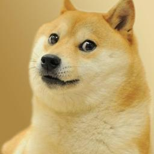
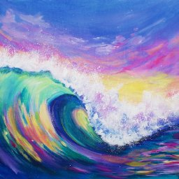

# Neural Networks
#### Eric Smith, Tyler Giallanza, Oscar Vallner, Momin Irfan

This repo contains the lab reports for CSE 8321: Neural Networks. Click on a lab folder to read our full reports.
_______
## Lab 1: DeepDream

DeepDream is a technique used for image generation from pre-trained convolutional neural networks. Although the technique is most famous for producing outlandish-looking artistic pictures, there are practical use-cases as well. We started with an implementation of InceptionV3 that had been pretrained on the ImageNet dataset. This code was heavily based on Francois Chollet's implementation provided in the Deep Learning with Python book and implemented [here](https://github.com/fchollet/deep-learning-with-python-notebooks/blob/master/8.2-deep-dream.ipynb).


_________

## Lab 2: Style Transfer
In this lab, we implemented photo style transfer from the [Universal Style Transfer](https://arxiv.org/abs/1705.08086) paper and applied photorealistic stylization [also from by Li *et al*](https://arxiv.org/abs/1705.08086). We implemented unpooling by creating our own custom layers: MaxPoolingMax2D and Unpooling. The MaxPoolingMask2D is used with our encoder to save the locations of the maximums when the image is pooled whilst encoded. The unpooling takes the encoded image and the masks which it then unpools.

|Content|Style|Output|Smoothed|
|---|---|---|---|
|||||
|||||
|||||
|||||


```python

```
